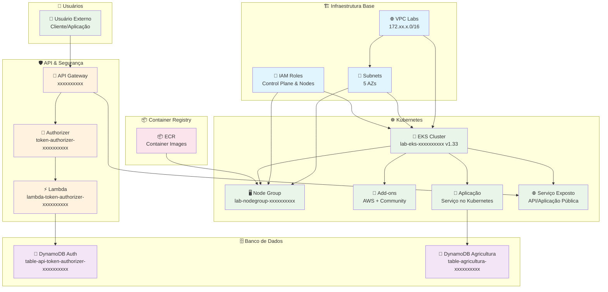

# 🚀 AWS Infrastructure - Click Ops Resources

> **📍 Região:** us-east-1 (N. Virginia)

Este documento descreve todos os recursos AWS criados via click-ops para o ambiente de laboratório Kubernetes.

## 📋 Índice

- [🌐 Rede e VPC](#-rede-e-vpc)
- [🔐 IAM Roles](#-iam-roles)
- [🛡️ API Gateway](#️-api-gateway)
- [⚡ Lambda Functions](#-lambda-functions)
- [🗄️ DynamoDB](#️-dynamodb)
- [☸️ Kubernetes (EKS)](#️-kubernetes-eks)
- [📦 ECR - Container Registry](#-ecr---container-registry)
- [🏗️ Arquitetura da Solução](#-arquitetura-da-solução)

---

## 🌐 Rede e VPC

### 🏗️ VPC Principal

- **Nome:** VPC Labs
- **VPC ID:** `vpc-xxxxxxxxxx`
- **CIDR:** `172.xx.x.0/16`

### 🔗 Subnets e Availability Zones

| Subnet ID           | AZ         | CIDR             | Zona |
| ------------------- | ---------- | ---------------- | ---- |
| `subnet-xxxxxxxxxx` | us-east-1a | `172.xx.x.0/20`  | az1  |
| `subnet-xxxxxxxxxx` | us-east-1b | `172.xx.xx.0/20` | az2  |
| `subnet-xxxxxxxxxx` | us-east-1c | `172.xx.xx.0/20` | az3  |
| `subnet-xxxxxxxxxx` | us-east-1d | `172.xx.xx.0/20` | az4  |
| `subnet-xxxxxxxxxx` | us-east-1f | `172.xx.xx.0/20` | az5  |

---

## 🔐 IAM Roles

- 👤 `lab-role-aws-xxxxxxxxxx-managed`
- 🖥️ `lab-role-aws-xxxxxxxxxx-use-services`

---

## 🛡️ API Gateway

### 📡 API Lab

- **API ID:** `xxxxxxxxxx`
- **Endpoint:** `https://xxxxxxxxxx.execute-api.us-east-1.amazonaws.com/`

### 🔑 Authorizer

- **Nome:** `token-authorizer-xxxxxxxxxx`

---

## ⚡ Lambda Functions

- 🔐 `lambda-token-authorizer-xxxxxxxxxx`

---

## 🗄️ DynamoDB

### 🔐 Tabela de Autorização de Tokens

- **Nome:** `table-api-token-authorizer-xxxxxxxxxx`
- **🎯 Uso:** Validação de tokens pela função Lambda Authorizer

### 🌱 Tabela de Agricultura

- **Nome:** `table-agricultura-xxxxxxxxxx`
- **📚 Fonte de Dados:** [Picture This AI](https://www.picturethisai.com/pt/wiki)
- **🎯 Uso:** Dados acessados por aplicações no cluster Kubernetes

---

## ☸️ Kubernetes (EKS)

### ⚙️ Configuração do Cluster

| Parâmetro                    | Valor                              |
| ---------------------------- | ---------------------------------- |
| **Nome**                     | `lab-eks-xxxxxxxxxx`               |
| **Versão**                   | 1.33                               |
| **Política de Upgrade**      | Standard support                   |
| **Acesso ao Cluster**        | Allow cluster administrator access |
| **Modo de Autenticação**     | EKS API                            |
| **ARC Zonal Shift**          | ❌ Disabled                         |
| **Proteção contra Exclusão** | ❌ Off                              |
| **Tags**                     | `lab:kubernetes`                   |

### 🌐 Configuração de Rede

- **VPC ID:** `vpc-xxxxxxxxxx` (default)
- **Subnets:**
  - `subnet-xxxxxxxxxx`
  - `subnet-xxxxxxxxxx`
  - `subnet-xxxxxxxxxx`
- **Security Groups:** EKS cria automaticamente
- **Família de Endereços IP:** IPv4
- **Range de IPs do Kubernetes Service:** `172.xx.x.0/16`
- **Acesso ao API Server:** Public and private

### 📊 Observabilidade

- **CloudWatch Metrics:** ✅ Habilitado

### 🧩 Add-ons

#### AWS Managed Add-ons

- ✅ CoreDNS
- ✅ Node monitoring agent
- ✅ Amazon VPC CNI
- ✅ kube-proxy
- ✅ Amazon CloudWatch Observability
- ✅ Amazon EBS CSI Driver
- ✅ Amazon EKS Pod Identity Agent

#### Community Add-ons

- ✅ External DNS
- ✅ Kube State Metrics
- ✅ Cert Manager
- ✅ Fluent Bit
- ✅ Metrics Server

### 🖥️ Node Groups

#### Configuração Geral

- **Nome:** `lab-nodegroup-xxxxxxxxxx`
- **EC2 Launch Template:** ❌ Off

#### 💻 Computação e Scaling

| Parâmetro           | Valor               |
| ------------------- | ------------------- |
| **AMI Type**        | Bottlerocket x86_64 |
| **Capacity Type**   | Spot                |
| **Instance Type**   | t3.medium           |
| **Quantidade**      | 3                   |
| **vCPUs**           | 2                   |
| **Arquitetura**     | x86_64              |
| **Memória**         | 4 GiB               |
| **Disk Size (EBS)** | 20 GiB              |

#### 📈 Configuração de Scaling

| Parâmetro        | Valor |
| ---------------- | ----- |
| **Desired Size** | 3     |
| **Minimum Size** | 3     |
| **Maximum Size** | 3     |

#### 🔄 Configuração de Update

| Parâmetro                     | Valor   |
| ----------------------------- | ------- |
| **Maximum Unavailable Type**  | Number  |
| **Maximum Unavailable Value** | 1       |
| **Update Strategy**           | Default |
| **Auto Repair**               | ❌ Off   |

#### 🌐 Configuração de Rede dos Node Groups

- `subnet-xxxxxxxxxx`
- `subnet-xxxxxxxxxx`
- `subnet-xxxxxxxxxx`

---

## 📦 ECR - Container Registry

- **Repository Name:** `xxxxxxxx.dkr.ecr.us-east-1.amazonaws.com/xxxxxxxx`
- **Image Tag Mutability:** Mutable
- **Encryption Settings:** AES-256

---

## 🏗️ Arquitetura da Solução

---

**📝 Nota:** Este documento reflete a configuração atual dos recursos criados via click-ops. Para automação futura, considere migrar para Infrastructure as Code (IaC) usando Terraform ou CloudFormation.
